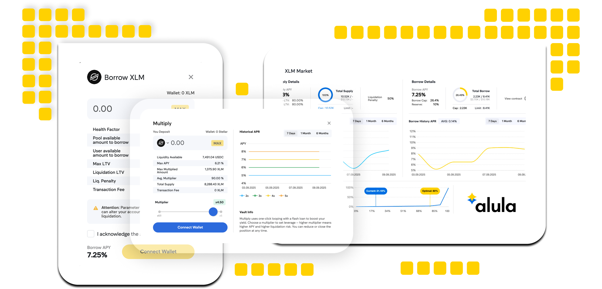

# Home

<h2 align="center">Institution-ready RWA lending protocol on Stellar </h2>

<figure><figcaption></figcaption></figure>

Alula is an institutional-grade RWA money-market protocol on Stellar designed to bring real-world credit on-chain in a policy-aligned way. It combines configurable, segregated lending pools with a yield-optimization layer that keeps liquidity productive even when some pools are underutilized. Built on Stellar’s compliance and settlement stack, Alula enables institutions to originate and fund RWA-backed credit on-chain, while giving liquidity providers transparent, risk-aligned yield in Stellar assets.

<table data-view="cards"><thead><tr><th></th><th></th><th></th><th data-hidden data-card-target data-type="content-ref"></th><th data-hidden data-card-cover data-type="files"></th></tr></thead><tbody><tr><td><i class="fa-stairs">:stairs:</i></td><td><strong>User Guides &#x26; Explainers</strong></td><td>Learn how to use Alula's borrowing, lending, and multiplying functionality. Meant for regular users.</td><td><a href="https://app.gitbook.com/o/Jm7fbj2hqrM8vM6cBN2z/s/HhKLLJYbZHoXoMlf20ED/">User Guides &#x26; Explainers</a></td><td></td></tr><tr><td><h4><i class="fa-book-open">:book-open:</i></h4></td><td><strong>Business &#x26; Tech Docs</strong></td><td>Discover how Alula works under the hood. Meant for investors, partners, contributors, and others.</td><td><a href="https://app.gitbook.com/o/Jm7fbj2hqrM8vM6cBN2z/s/yweyoRtvIme1qFCRhOhX/">Business &#x26; Tech Docs</a></td><td></td></tr><tr><td><h4><i class="fa-terminal">:terminal:</i></h4></td><td><strong>API Reference</strong></td><td>Browse, test, and interact with Alula's API endpoints.</td><td><a href="https://app.gitbook.com/o/Jm7fbj2hqrM8vM6cBN2z/s/17CjxR711oikYp6I06V4/">API Reference</a></td><td></td></tr></tbody></table>

***

<h2 align="center">Follow &#x26; contact us</h2>

<table data-view="cards"><thead><tr><th></th><th></th><th data-hidden data-card-cover data-type="image">Cover image</th><th data-hidden data-card-target data-type="content-ref"></th></tr></thead><tbody><tr><td><i class="fa-telegram">:telegram:</i></td><td>Telegram</td><td></td><td><a href="https://t.me/vladimir_vs90">https://t.me/vladimir_vs90</a></td></tr><tr><td><i class="fa-envelope">:envelope:</i></td><td>Email</td><td></td><td><a href="mailto:vs@alula.finance">mailto:vs@alula.finance</a></td></tr><tr><td><i class="fa-square-x-twitter">:square-x-twitter:</i></td><td>X.com</td><td></td><td><a href="https://x.com/AlulaProtocol">https://x.com/AlulaProtocol</a></td></tr></tbody></table>

