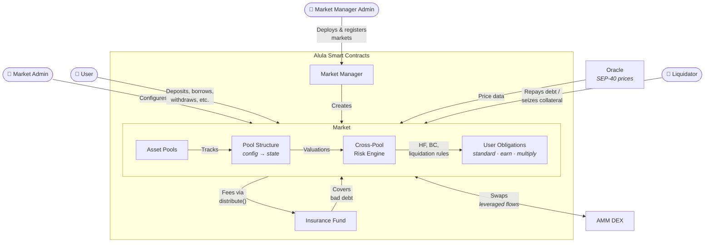

# Architecture Overview

::: info
Below are high-level descriptions of each component. For detailed technical descriptions, refer to:

- [Architecture Components](../deep-dive/architecture-components.md)
- [Market Methods](../deep-dive/market-methods.md)
- [Configurable Parameters](../deep-dive/configurable-parameters.md)
- [User Roles and Authorizations](../deep-dive/user-roles-and-authorizations.md)
:::

#### Market Manager admin

Protocol-level administrator that deploys new lending markets and maintains the registry of deployed markets (controlled via multisig).

#### Market admin

Operator of a specific market who sets parameters, controls operating status, and manages fees for that market.

#### User

Anyone who deposits to earn yield, borrows against posted assets, manages positions, or views market information.

#### Market Manager (smart contract)

Factory and registry contract that creates new markets and keeps a discoverable directory of deployed markets.

#### Market (smart contract)

The contract where lending and borrowing occur. It manages asset pools, enforces market rules, tracks user positions, and coordinates with external price feeds and exchanges, including liquidations and other safeguards.

#### Insurance fund (smart contract)

A per-market safety buffer funded by fees. It absorbs residual losses after liquidations before any shortfall is socialized to lenders.

::: info
Learn more in [Insurance Fund](risk-management/insurance-fund.md)
:::

#### Asset pool

A per-asset liquidity pool (e.g., XLM, USD) that holds data about total deposits, plain collateral supplied, and total loans for that asset.

::: info
Learn more in [Asset Pool](risk-management/asset-pool.md)
:::

#### Pool structure (pool config → pool state)

The market’s policy and accounting layer. It defines pool rules and tracks live totals such as available liquidity, borrowed amounts, collateral, and fees.

#### User obligations (including Multiply obligations)

A user’s position record in a market that summarizes deposits, collateral, and borrows, and is used to assess whether the position remains safe.

#### Cross-pool

Shared risk engine that evaluates positions across assets, allows collateral in one pool to support borrowing in another, and determines when liquidations are permitted.

#### AMM DEX

External exchange used for token swaps when needed during leveraged position flows.

#### Oracle

External price service that provides current asset prices so the market can value collateral and debt and run risk checks.

#### Liquidator

Permissionless third party that repays debt on unhealthy positions in exchange for collateral at a discount (liquidation bonus).

::: info
For detailed technical descriptions, please see [Architecture Components](../deep-dive/architecture-components.md)
:::
